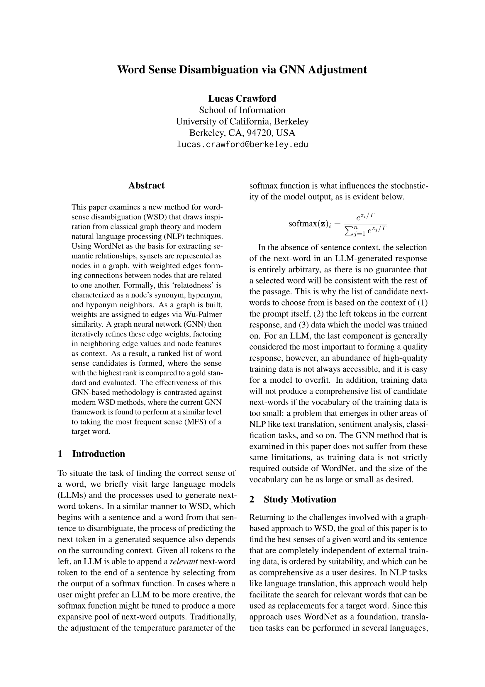
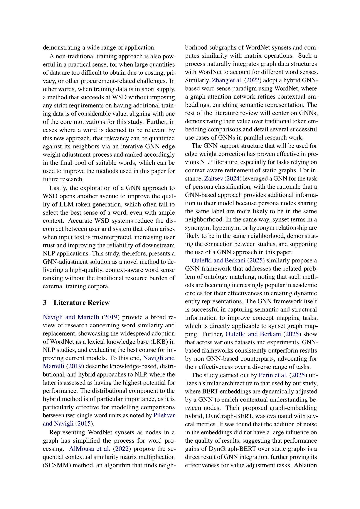
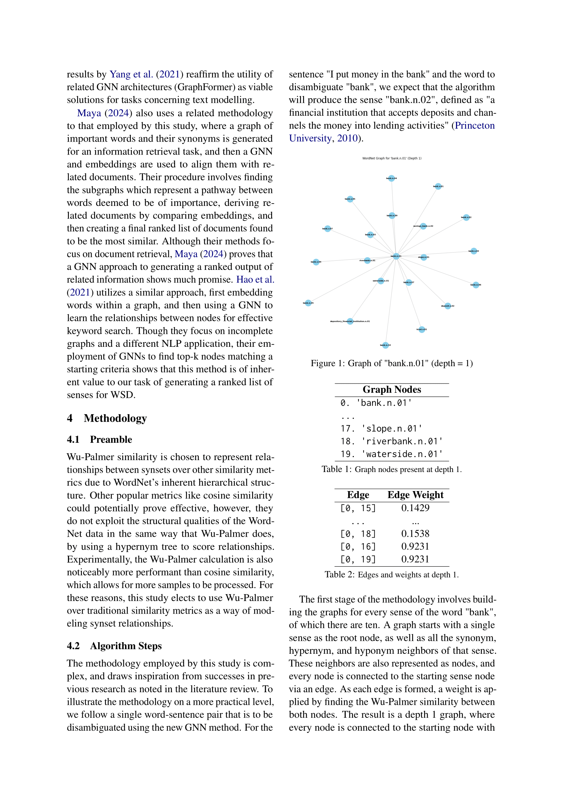
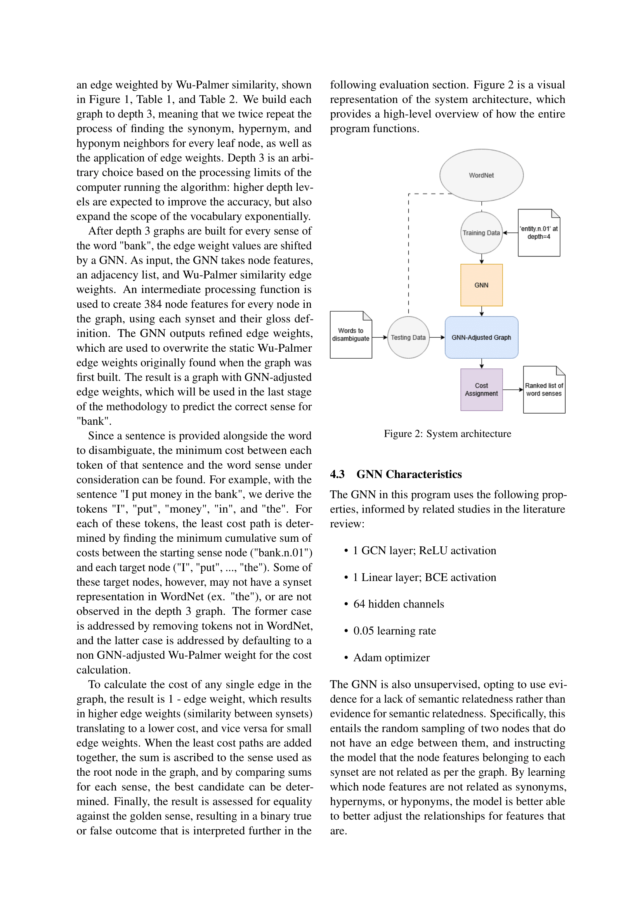
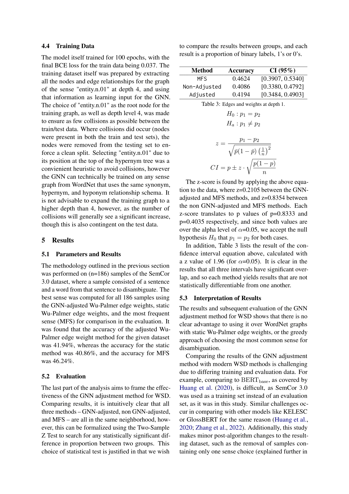
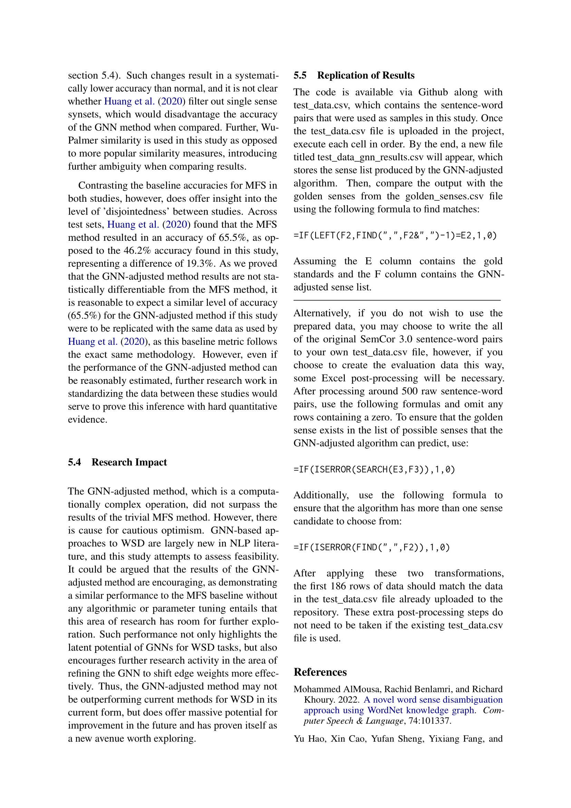
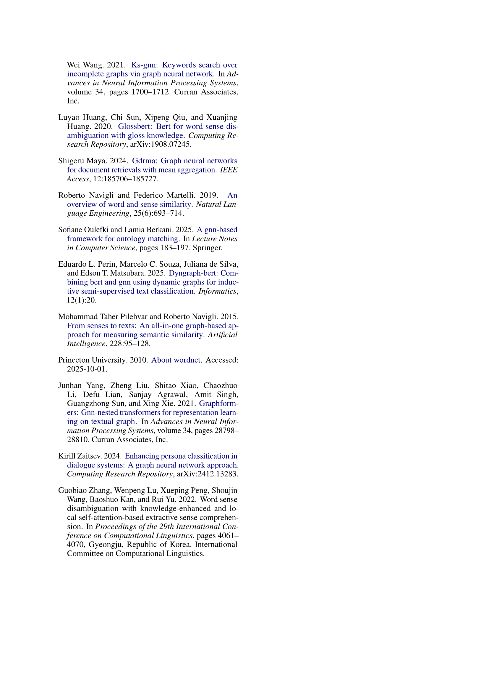

# make-sense

Insert test_data.csv into the sample_data folder and run all cells in MakeSense.ipynb.

You will see a new file test_data_gnn_results.csv. Merge this file with golden_senses and used the formulas from the paper to evaluate.

If you can't open MakeSense.ipynb for some reason, use this link: https://colab.research.google.com/drive/1ffiS-UZT4VbgA-5PFQj3yyJ-XYYn4adA?usp=sharing

